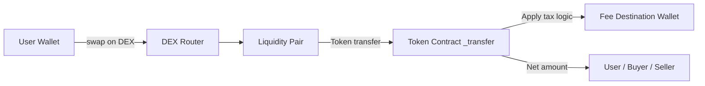
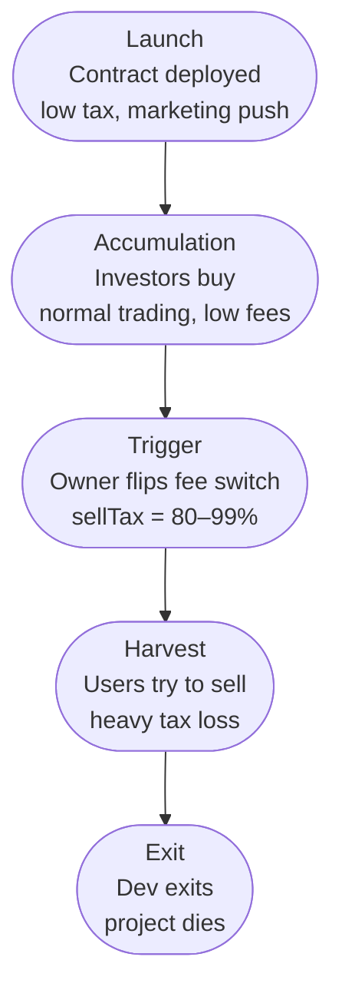
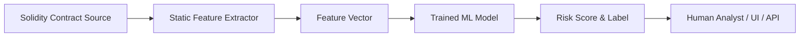

# The Science of Token Tax Abuse  
### How Dangerous Developers Weaponize Fee Logic in Smart Contracts

> *A full-stack deep dive into how fee logic is implemented, abused, hidden, detected, and modeled with machine learning in modern ERC-20 style tokens.*

---

## Table of Contents

1. [Introduction](#introduction)  
2. [Background: How Token Fees Work](#background-how-token-fees-work)  
   - [Legitimate Use-Cases for Fees](#legitimate-use-cases-for-fees)  
   - [Where Fees Live in the Contract](#where-fees-live-in-the-contract)  
3. [Execution Flow of Fee Logic](#execution-flow-of-fee-logic)  
   - [Deep Dive: _transfer Logic](#deep-dive-_transfer-logic)  
   - [How DEX Routers Interact With Fees](#how-dex-routers-interact-with-fees)  
   - [Mermaid Diagram: Token Transfer Pipeline](#mermaid-diagram-token-transfer-pipeline)  
4. [Tax Abuse: Formal Definition](#tax-abuse-formal-definition)  
5. [Attack Taxonomy: Types of Tax Abuse](#attack-taxonomy-types-of-tax-abuse)  
   - [1. Dynamic Tax Flipping](#1-dynamic-tax-flipping)  
   - [2. Hidden Sell-Only Taxes](#2-hidden-sell-only-taxes)  
   - [3. Whitelist-Backed Fee Bypass](#3-whitelist-backed-fee-bypass)  
   - [4. Max-Tx + Fee Bomb Combo](#4-max-tx--fee-bomb-combo)  
   - [5. Time- or Block-Based Tax Traps](#5-time--or-block-based-tax-traps)  
   - [6. Liquidity-Drain Tax Funnels](#6-liquidity-drain-tax-funnels)  
   - [7. Reflection-Style Obfuscation](#7-reflection-style-obfuscation)  
6. [Solidity Deep Dive: How Attackers Implement Tax Abuse](#solidity-deep-dive-how-attackers-implement-tax-abuse)  
   - [Abusive Fee Variables & Functions](#abusive-fee-variables--functions)  
   - [Hiding Logic in Modifiers](#hiding-logic-in-modifiers)  
   - [Nested Internal Calls & Obfuscation Tricks](#nested-internal-calls--obfuscation-tricks)  
7. [Attack Timelines: From Launch to Rug](#attack-timelines-from-launch-to-rug)  
   - [Timeline Diagram (Mermaid)](#timeline-diagram-mermaid)  
8. [Mathematics of Tax Abuse](#mathematics-of-tax-abuse)  
   - [Per-Trade Loss Model](#per-trade-loss-model)  
   - [Expected Loss Over Multiple Sells](#expected-loss-over-multiple-sells)  
   - [Liquidity Drain Modeling](#liquidity-drain-modeling)  
9. [Defensive Engineering: Manual Audit Checklist](#defensive-engineering-manual-audit-checklist)  
10. [Machine Learning for Tax Abuse Detection](#machine-learning-for-tax-abuse-detection)  
    - [Feature Engineering](#feature-engineering)  
    - [Model Architecture](#model-architecture)  
    - [From Probability to Risk Score](#from-probability-to-risk-score)  
    - [Explainability (SHAP) for Fee Logic](#explainability-shap-for-fee-logic)  
    - [Mermaid Diagram: ML Detection Pipeline](#mermaid-diagram-ml-detection-pipeline)  
11. [Behavioral & On-Chain Signals](#behavioral--on-chain-signals)  
12. [Putting It All Together](#putting-it-all-together)  
13. [Conclusion](#conclusion)  

---

## Introduction

Token “taxes”, transaction fees embedded into ERC-20 style smart contracts, started as a simple economic mechanism:

- Charge a small fee on each transfer  
- Use it to reward holders, fund development, or add liquidity  

But in the hands of malicious developers, these fees turn into a **powerful, stealthy weapon**.

They can be used to:

- silently siphon value from traders over time  
- trap users in honeypots where selling is suicidal  
- disguise rugpulls as “tokenomics”  
- hide behind complex, obfuscated fee logic  

This article takes a **scientific, engineering, and ML-driven look** at token tax abuse:

- how it works at the Solidity level  
- how attackers design their logic  
- how to model the damage mathematically  
- and how to detect it using machine learning and static analysis.

---

## Background: How Token Fees Work

### Legitimate Use-Cases for Fees

Many projects implement fees for *legitimate* reasons:

- **Liquidity fees**: a portion of each trade is used to add liquidity to the pool.  
- **Reflection/redistribution**: fees are redistributed to holders.  
- **Marketing & development**: a portion funds core operations or marketing.  
- **Buyback & burn**: fees are used to burn supply and support price.

So **fees themselves are not evil**. The danger comes from:

- how fee parameters can be changed  
- who controls them  
- and how they interact with DEX trading behavior.

---

### Where Fees Live in the Contract

In most ERC-20 tokens with taxes, fee logic lives in or around the `_transfer` function.

Typical pattern:

```solidity
function _transfer(
    address from,
    address to,
    uint256 amount
) internal virtual {
    uint256 feeAmount = calculateFee(from, to, amount);
    uint256 amountAfterFee = amount - feeAmount;

    _balances[from] -= amount;
    _balances[to] += amountAfterFee;

    // route the fee to some wallet or logic
    _takeFee(feeAmount);

    emit Transfer(from, to, amountAfterFee);
}
````

The core “hook” for tax abuse is:

* `calculateFee(...)`
* `_takeFee(...)`
* and any owner-controlled hooks around them.

---

## Execution Flow of Fee Logic

### Deep Dive: _transfer Logic

A basic, non-taxed ERC-20 `_transfer` is simple:

```solidity
function _transfer(address from, address to, uint256 amount) internal virtual {
    require(from != address(0) && to != address(0), "zero address");
    require(_balances[from] >= amount, "insufficient balance");

    _balances[from] -= amount;
    _balances[to] += amount;

    emit Transfer(from, to, amount);
}
```

With taxes, it becomes:

```solidity
function _transfer(address from, address to, uint256 amount) internal virtual {
    require(from != address(0) && to != address(0), "zero address");
    require(_balances[from] >= amount, "insufficient balance");

    uint256 feeAmount = _calculateFee(from, to, amount);
    uint256 netAmount = amount - feeAmount;

    _balances[from] -= amount;
    _balances[to] += netAmount;

    if (feeAmount > 0) {
        _takeFee(from, feeAmount);
    }

    emit Transfer(from, to, netAmount);
}
```

This flexible structure is exactly what attackers exploit.

---

### How DEX Routers Interact With Fees

On Uniswap-like DEXes, swaps typically go:

* user ↔ router contract
* router ↔ pair contract (liquidity pool)
* token ↔ WETH (or other base pair)

When a user buys or sells a token:

1. User calls `swapExactETHForTokens` or similar on the router
2. Router sends tokens to the user / LP pair
3. The token’s `_transfer` executes between router/pair and user

The token contract controls:

* how much is actually received or sent after fees
* who receives the fees
* whether the router or pair is treated specially

A malicious token can:

* treat buys differently from sells
* apply different taxes based on whether `from` or `to` is the pair address
* completely devastate sellers by taxing sell routes heavily.

---

### Mermaid Diagram: Token Transfer Pipeline



Key observation:
Even though users interact with the DEX router, **all the power is inside the token contract’s `_transfer` logic**.

---

## Tax Abuse: Formal Definition

We’ll define **token tax abuse** as:

> *Any design of transaction fee logic in a token contract that is intentionally structured to mislead, trap, or extract value from users beyond what is transparently communicated, especially via hidden, dynamic, owner-controlled, or context-sensitive fee mechanisms.*

Characteristics:

* Hidden or non-obvious high taxes
* Owner-controlled tax manipulation after launch
* Conditional “trigger events” (time, block, price, volume)
* Whitelists or blacklists that change fees based on address
* Unreasonably high caps (`sellTax` up to 100%)

---

## Attack Taxonomy: Types of Tax Abuse

Here’s a practical taxonomy you can use while auditing.

### 1. Dynamic Tax Flipping

Start with:

* low buy/sell tax at launch
* after enough buyers enter → increase sell tax to extreme levels

**Example pattern:**

```solidity
uint256 public sellFee = 2;

function setSellFee(uint256 fee) external onlyOwner {
    require(fee <= 100, "too high"); // still allows absurd values
    sellFee = fee;
}
```

Attackers call `setSellFee(80)` or `setSellFee(99)` after launch.

---

### 2. Hidden Sell-Only Taxes

Code appears to show “2% tax”, but real logic has a special path for sells.

```solidity
function _calculateFee(address from, address to, uint256 amount) internal view returns (uint256) {
    uint256 fee = buyFee;

    if (isSell(from, to)) {
        fee = sellFee * multiplier; // multiplier can be 5x, 10x, etc.
    }

    return (amount * fee) / 100;
}

function isSell(address from, address to) internal view returns (bool) {
    return to == uniswapV2Pair; // treat sends to LP as "sell"
}
```

Attackers set `multiplier` high after investors are in.

---

### 3. Whitelist-Backed Fee Bypass

Owner or certain privileged wallets can bypass the fee logic entirely.

```solidity
mapping(address => bool) public isWhitelisted;

function _transfer(address from, address to, uint256 amount) internal override {
    if (isWhitelisted[from] || isWhitelisted[to]) {
        super._transfer(from, to, amount);
        return;
    }

    uint256 taxed = _taxAmount(amount);
    ...
}
```

Attackers:

* whitelist themselves
* tax everyone else brutally.

---

### 4. Max-Tx + Fee Bomb Combo

Combining **max transaction size** with **high tax** makes selling nearly impossible.

```solidity
uint256 public maxTxAmount;

function _transfer(address from, address to, uint256 amount) internal override {
    require(amount <= maxTxAmount, "Too big");

    uint256 taxAmount = amount * sellFee / 100;
    ...
}
```

If:

* `maxTxAmount = 1% of your balance`
* `sellFee = 25%`

→ Users must sell in many small chunks, losing heavily to fees each time.

---

### 5. Time- or Block-Based Tax Traps

Fee logic changes after some time/block conditions:

```solidity
uint256 public launchBlock;

function _calculateFee(...) internal view returns (uint256) {
    if (block.number < launchBlock + 5) {
        return amount * 20 / 100;  // anti-bot
    } else if (block.number > launchBlock + 10000) {
        return amount * 90 / 100;  // rugpull mode
    }
    return amount * 2 / 100;
}
```

This looks like anti-bot but becomes a time-delayed rugpull.

---

### 6. Liquidity-Drain Tax Funnels

Fees routed directly or indirectly to dev-controlled wallets or LP removal addresses.

```solidity
address public devWallet;

function _takeFee(uint256 amount) internal {
    _balances[devWallet] += amount;
}
```

Or even more sneaky, routing through intermediate contracts that eventually send funds to devs.

---

### 7. Reflection-Style Obfuscation

Reflection tokens use complex internal accounting. Scammers hide abusive fee logic inside this complexity:

* reflection supply vs total supply
* weird mapping naming
* fee logic split across 5+ functions

Unless the auditor understands reflection math, it’s easy to hide tax abuse here.

---

## Solidity Deep Dive: How Attackers Implement Tax Abuse

### Abusive Fee Variables & Functions

Red flags:

```solidity
uint256 public buyTax;
uint256 public sellTax;
uint256 public marketingTax;
uint256 public devFee;
uint256 public extraSellTax; // suspicious extras

function setBuyTax(uint256 _tax) external onlyOwner { buyTax = _tax; }
function setSellTax(uint256 _tax) external onlyOwner { sellTax = _tax; }
function setFees(...) external onlyOwner { ... } // big multi-param setter
```

Large numbers of fee variables often indicate:

* multiple hidden tax channels
* complex fee routing to mask dev extraction.

---

### Hiding Logic in Modifiers

Modifiers can contain fee-related conditions:

```solidity
modifier tradingOpen() {
    require(_tradingEnabled, "Trading not enabled");
    _;
}
```

Or worse:

```solidity
modifier taxed(address from, address to, uint256 amount) {
    uint256 tax = _calculateFee(from, to, amount);
    _;
    _applyTax(from, tax);
}
```

Connected with:

```solidity
function _transfer(address from, address to, uint256 amount)
    internal
    tradingOpen
    taxed(from, to, amount)
{
    ...
}
```

Fee logic hides inside modifiers, not direct `_transfer`.

---

### Nested Internal Calls & Obfuscation Tricks

Common obfuscation patterns:

* `_transfer` calls `_tokenTransfer`, which calls `_executeTransfer`, which calls `_takeFee` only in certain branches.
* Using meaningless names:

```solidity
function fireRocket(...) internal { ... } // actually does fee routing
```

* Splitting fee math across several functions:

```solidity
function _preTransferCheck(...) internal { ... }
function _postTransferHook(...) internal { ... }
```

One of them might sneak in tax logic.

---

## Attack Timelines: From Launch to Rug

Most tax-abuse scams follow a **time-based playbook**.

1. **Launch Phase**

   * Owner sets low fee: 1–5%
   * Hype, Telegram, influencers
   * Contract looks “normal” on quick scan

2. **Accumulation Phase**

   * Investors buy in
   * Liquidity grows
   * Early trades look OK → confidence rises

3. **Trigger Phase**

   * Owner calls `setSellFee(80)`
   * Or time-based logic automatically increases taxes
   * Or trading conditions change (thresholds hit)

4. **Harvest Phase**

   * Sellers get destroyed by high taxes
   * Tax flows to dev wallets
   * Dev slowly dumps or pulls tax funds

5. **Exit Phase**

   * Dev removes LP / dumps collected tokens
   * Token price collapses
   * Social channels go silent

---

### Timeline Diagram (Mermaid)



---

## Mathematics of Tax Abuse

Let’s model the damage.

### Per-Trade Loss Model

Assume:


Then:


If tax is **applied only on sells**, a user who:


---

### Expected Loss Over Multiple Sells

If a max-tx system forces a user to sell in ( n ) chunks, each with tax ( t ):


So a flat tax is linear.

But: if t increases with each sell or based on conditions, effective loss can be **super-linear** in practice.

Example:
First sells: 10% tax.
Later sells: 40% tax due to dynamic fee escalators.

---

### Liquidity Drain Modeling

If a token routes all fees to a dev wallet which then **sells** those tokens for base currency, then:

* User sells pay tax → dev accumulates tokens
* Dev’s sells further push price down → amplifies user loss


High tax + many traders = huge economic drain.

---

## Defensive Engineering: Manual Audit Checklist

Here’s a practical checklist you can use when auditing token fee logic.

### Fee Variable & Function Checks

1. Search for `fee`, `tax`, `buyFee`, `sellFee`, `marketingFee`, `devFee`.
2. Confirm all fee variables are visible and not misleadingly named.
3. Check maximum allowed tax values (`require(fee <= X)`).
4. Inspect `setFee`, `setTax`, `setBuyFee`, `setSellFee` functions.
5. Verify who can call these functions (onlyOwner? multi-sig?).
6. Ensure there is *no* function that sets fees near 100%.

### `_transfer` & Fee Flow

7. Find all implementations of `_transfer`.
8. Track calls to `_calculateFee`, `_taxAmount`, `_takeFee`, etc.
9. Confirm that **every** token movement goes through the same logic (no “backdoor transfers”).
10. Check for `if` conditions specific to DEX pair addresses.
11. Verify buys and sells don’t get wildly different treatments.

### Whitelist / Blacklist Danger

12. Search for `whitelist`, `blacklist`, `isWhitelisted`, `canTrade`, `blocked`.
13. If whitelists exist, check if they bypass fee logic.
14. Confirm there is no centrally controlled blacklist that can block sellers selectively.
15. Look for `require(!blacklisted[from])` in `_transfer`.

### Dynamic / Time-Based Triggers

16. Search for `block.number`, `block.timestamp`, `launchBlock`, `launchTime`.
17. Check for conditions that dramatically change tax after certain blocks.
18. Verify that “anti-bot” measures cannot be reactivated later.
19. Watch out for thresholds based on `totalSupply`, `balanceOf(pair)`, or price.

### Ownership & Control

20. Inspect `owner()`, `onlyOwner`, `renounceOwnership`.
21. Confirm whether ownership is truly renounced (or just appears so).
22. Look for proxy patterns that allow reintroducing owner control.
23. Check if fee wallets can be changed by the owner.

### Fee Destination

24. Trace where fee tokens go: marketing wallet, dev wallet, burn address, LP, etc.
25. Verify that “burn” addresses are actually `0x000...0` or dead, not dev-controlled.
26. If fees go to a contract, inspect that contract too.
27. Verify no “recoverTokens” or “sweep” functions drain those wallets.

### Code Complexity & Obfuscation

28. Look for unnecessary layers: `_transfer → _tokenTransfer → _execute → _afterTransfer`.
29. Check modifiers used on `_transfer` or public transfer functions.
30. Be suspicious of unusual naming like `fireRocket`, `blessHolders`, `rebasePower` tied into `_transfer`.
31. Count how many different fee types are combined (reflection, LP, dev, marketing, etc.) — more complexity, more hiding potential.

### Testing Scenarios

32. Simulate a buy and sell with different fee settings.
33. Verify behavior when owner changes fee variables.
34. Check what happens near launch conditions (early blocks).
35. Simulate sells from different accounts (whitelisted vs normal).
36. Confirm max-tx + fee combinations don’t trap sellers.

### Documentation vs Code

37. Compare whitepaper/website claims vs actual code.
38. Ensure claimed fee ranges match contract possibilities.
39. Check if “renounced ownership” is truly implemented.
40. Be wary when documentation is vague about fees and control.

This checklist alone can drastically reduce exposure to tax-abuse contracts.

---

## Machine Learning for Tax Abuse Detection

Beyond manual audits, ML can scale detection over thousands of contracts.

### Feature Engineering

At **token level**, you can build a feature vector like:

* `n_lines`, total lines of code
* `n_public`, count of `public`
* `n_external`, count of `external`
* `has_set_fee`, binary (1 if any fee setter exists)
* `has_dynamic_fee`, any time-conditional fee logic
* `has_whitelist`, presence of whitelist logic
* `has_blacklist`
* `has_trading_lock`, presence of flags like `tradingOpen`
* `has_max_tx`, presence of `maxTxAmount`
* `fee_to_owner_flow`, heuristics about fee routing dest

At **deployer level**, you can aggregate:

* `n_contracts`
* `n_high_risk_tokens`
* `n_safe_tokens`
* `frac_rugpull`
* `avg_tax_complexity`

### Model Architecture

Typical choice: **RandomForestClassifier** or Gradient Boosting.

* Handles mixed binary + numeric features
* Robust to noisy labels
* Provides feature importance

The target label might be:

* `1` = high tax abuse risk
* `0` = low tax abuse risk

You can bootstrap labels via:

* manual auditing of a subset
* rough heuristics (“sellTax > 50% → 1”)
* public scam databases (if available)

---

### From Probability to Risk Score

Model outputs:


Convert to human-friendly score:


Then bucket:

* `0–20` → **Low**
* `21–60` → **Medium**
* `61–100` → **High**

You can expose:

* `risk_score`
* `risk_level`
* `label` (`safe`, `suspicious`, `tax_abuse_candidate`)

---

### Explainability (SHAP) for Fee Logic

To avoid “black box” fears, you can use SHAP values:

* Show how each feature contributed to a contract’s risk score
* bar charts showing:

  * `has_set_fee` +0.18
  * `has_trading_lock` +0.12
  * `has_blacklist` +0.09
  * `n_lines` +0.02

This helps analysts and users understand *why* a token scored as high-risk.

---

### Mermaid Diagram: ML Detection Pipeline



Optional extension:

* add a “Deployer Aggregator” node between C and D
* combine token-level and deployer-level features.

---

## Behavioral & On-Chain Signals

In addition to code-based features, you can use **on-chain behavior**:

* sudden spike in gas usage on sells
* rapid increase in dev wallet balances
* repeatedly rising sell tax after each wave of buys
* frequent deployments from same deployer with similar patterns
* large number of victims exiting with heavy slippage

Combining **code signals + behavioral signals + ML** produces the strongest detection system.

---

## Putting It All Together

We can now view token tax abuse detection as a layered system:

1. **Static code analysis**

   * Extract patterns and features
   * Immediate detection of extreme or structural abuse

2. **Machine learning inference**

   * Learn subtle combinations of features
   * Predict high-risk tokens even if patterns are partially obfuscated

3. **Deployer reputation modeling**

   * Capture repeated offenders
   * Penalize addresses that consistently produce abusive tokens

4. **On-chain behavioral analysis**

   * Watch live transaction behavior
   * Confirm suspicious patterns in practice

5. **On-chain registries & transparency**

   * Publish risk scores so dApps, wallets, and explorers can show warnings
   * Build a decentralized trust layer

---

## Conclusion

Token tax abuse is not just a code-level trick, it’s an **economic weapon** crafted through:

* carefully designed fee logic
* dynamic and conditional tax changes
* whitelists, blacklists, and trading locks
* and ultimately, user deception.

However, it’s **not unstoppable**.

By combining:

* **deep Solidity understanding**
* **systematic audit checklists**
* **rigorous mathematical modeling**
* and **machine learning over on-chain data**

we can:

* flag abusive tokens early
* identify malicious deployers
* and build smarter tools that protect users.

If you’re building Web3 security tools, this domain **token tax abuse detection**, is one of the most impactful areas you can work in.
